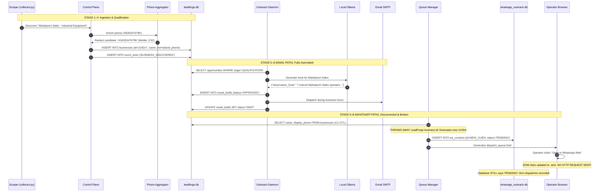
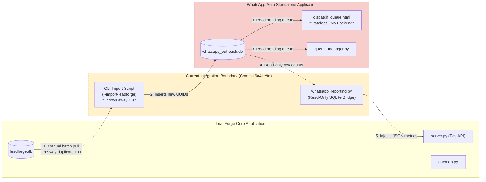
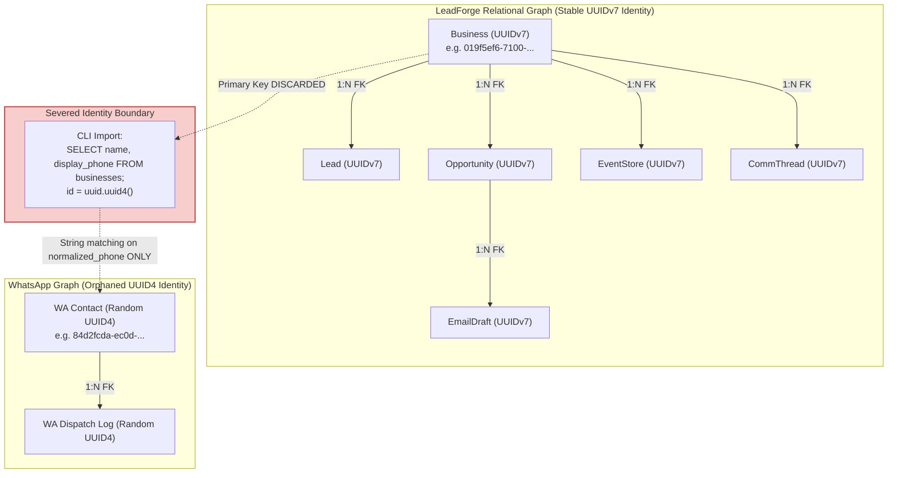
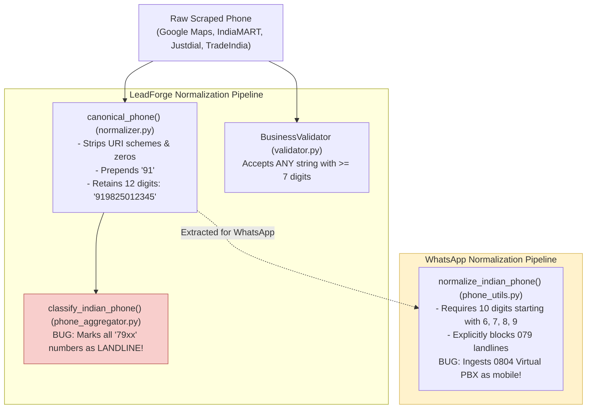
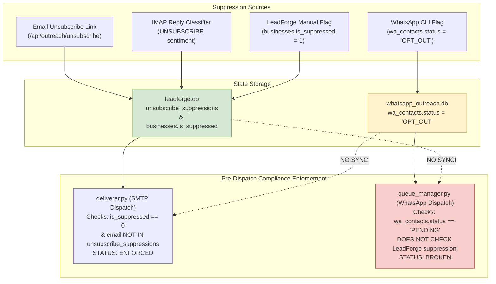
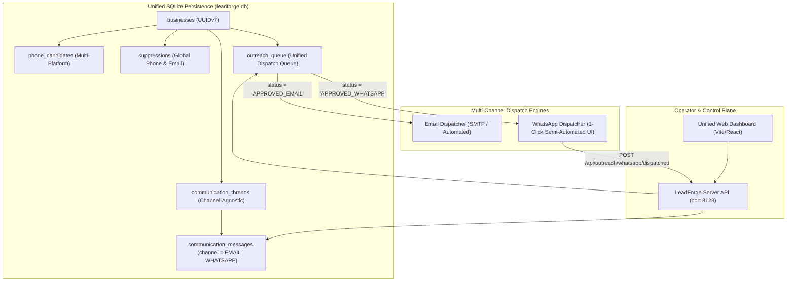
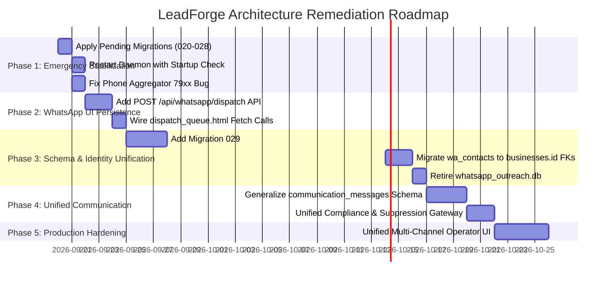

# LeadForge & WhatsApp-Auto Comprehensive Architecture Audit & Remediation Plan

**Role:** Senior Staff Systems & Data Architect  
**Target Repository:** LeadForge (`/mnt/data/rj/email_auto/leadforge`)  
**Commit Inspected:** `6a4be9a` (*feat(outreach): integrate whatsapp_auto module and read-only metrics reporting*)  
**Execution Environment:** Linux (x86_64), Python 3.14.7, SQLite 3 (WAL mode)  
**Live Production DB:** `leadforge/leadforge.db` (6.1 MB, 330 businesses) & `whatsapp_outreach.db` (56 KB, 60 contacts)  
**Audit Date:** September 2026  

---

## 1. Executive Summary

LeadForge today is a dual-system monolith with an unintegrated sidecar.

1. **LeadForge Core** is an automated B2B intelligence and cold-email outreach platform for Ahmedabad manufacturers. It features a Playwright scraper, opportunity scoring, a local Ollama LLM hook generator, an evidence quality gate, an automated 24/7 background daemon (`leadforge/daemon.py`), rate-limited SMTP delivery, and an IMAP reply monitor with Telegram alerts.
2. **WhatsApp-Auto** (`whatsapp_auto/`) was conceived as an independent, zero-ban, solo-operator manual outreach utility. It was recently physically merged into the LeadForge repository root, but it **is not architecturally integrated**. It operates out of its own detached SQLite database (`whatsapp_outreach.db`), generates new random UUIDs for businesses it copies from LeadForge, completely severs identity links, and maintains isolated queue states.
3. **The Current "Integration" is Purely Cosmetic:** It consists of a 100-line read-only query module (`leadforge/repositories/whatsapp_reporting.py`), a single server endpoint (`GET /api/whatsapp/metrics`), and a print statement in `scripts/daily_outreach.py`.
4. **Immediate Production Breakage Found:**
   - The production background daemon is **currently in an infinite crash loop** (logged in `logs/run.log`) failing every 30 seconds with `sqlite3.OperationalError: table email_drafts has no column named quality_score`. **Migrations 020 through 028 were never applied to the production `leadforge.db`**.
   - The WhatsApp HTML dashboard (`dispatch_queue.html`) **does not persist dispatches**. Clicking "Open in WhatsApp Web" executes a browser-side DOM toggle (`card.classList.add('sent')`) with zero HTTP backend requests. If the operator reloads the page, dispatch history is permanently lost, and the database remains in `PENDING` state with zero dispatch logs recorded.
   - **Suppression is non-functional across channels**: If a prospect unsubscribes from email outreach, their phone number remains `PENDING` in the WhatsApp queue. If a prospect asks to be removed on WhatsApp, LeadForge's email engine has no knowledge of it and will continue sending cold emails.

---

## 2. Repository Architecture & Subsystem Map

```mermaid
flowchart TD
    subgraph DiscoveryLayer["1. Discovery & Scraping Layer"]
        GMaps["Google Maps Scraper\n(collector.py / search.py)"]
        SIL["Search Intelligence Layer (SIL)\n(taxonomy.py / geo_resolver.py)"]
        DirScrapers["Directory Scrapers\n(IndiaMART / Justdial / TradeIndia)"]
    end

    subgraph CoreEngine["2. LeadForge Core Engine"]
        CP["Control Plane & State Machine\n(control_plane.py / execution_state.py)"]
        Val["Business Validator\n(validator.py)"]
        Merge["Deduplication & Merger\n(merge.py)"]
        OppEng["Opportunity Engine\n(opportunity_engine.py)"]
        ConfEng["Confidence Engine\n(confidence_engine.py)"]
    end

    subgraph PhoneLayer["3. Multi-Platform Phone Enrichment"]
        PhoneOrch["Phone Orchestrator\n(phone_orchestrator.py)"]
        Agg["Phone Candidate Aggregator\n(phone_aggregator.py)"]
        Providers["Providers: Website, IndiaMART,\nJustdial, TradeIndia"]
    end

    subgraph StorageLayer["4. Data & State Storage"]
        LF_DB[("Primary Database: leadforge.db\n(330 businesses, 40+ tables)")]
        EventStore["Immutable Event Ledger\n(event_store)"]
    end

    subgraph EmailPipeline["5. Autonomous Email Outreach Pipeline"]
        Daemon["24/7 Background Daemon\n(daemon.py / systemd-inhibit)"]
        OllamaHook["Ollama LLM Hook Generator\n(generator.py / llama3.2:3b)"]
        QualityGate["100-pt Quality Gate\n(quality.py)"]
        SMTPDeliver["SMTP Deliverer & Ramp\n(deliverer.py / ramp.py)"]
        IMAPMonitor["IMAP Reply Classifier\n(inbox.py / classifier.py)"]
        Telegram["Telegram Alerts\n(telegram_notifier.py)"]
    end

    subgraph WhatsAppSidecar["6. WhatsApp-Auto Sidecar (Unintegrated)"]
        ETL["One-Way CLI ETL\n(--import-leadforge)"]
        WA_DB[("Separate Database:\nwhatsapp_outreach.db\n(wa_contacts, wa_dispatch_logs)")]
        Tpl["Hardcoded Templates A, B, C\n(templates.py)"]
        URLGen["wa.me URL Builder\n(url_builder.py)"]
        QueueMgr["Queue Manager CLI\n(queue_manager.py)"]
        HTMLDash["Stateless HTML Dashboard\n(dispatch_queue.html)"]
        HumanOp["Solo Human Operator\n(Native WhatsApp Web/App)"]
    end

    subgraph Bridge["7. Read-Only Reporting Bridge"]
        RepRepo["whatsapp_reporting.py\n(SQLite mode=ro)"]
        ServerAPI["FastAPI Control Plane\n(server.py / port 8123)"]
        WebUI["React / Vite Frontend\n(frontend/)"]
    end

    %% Flow connections
    DiscoveryLayer --> CP
    CP --> PhoneOrch
    PhoneOrch --> Providers --> Agg --> CP
    CP --> Val --> OppEng --> ConfEng --> Merge --> LF_DB
    CP --> EventStore

    LF_DB --> Daemon
    Daemon --> OllamaHook --> QualityGate --> SMTPDeliver --> IMAPMonitor --> Telegram
    LF_DB -.->|One-way SQL copy\n(Throws away business ID)| ETL
    ETL --> WA_DB
    WA_DB --> QueueMgr --> HTMLDash
    HTMLDash -->|Deep-link click| HumanOp
    WA_DB -.->|Read-only stats| RepRepo
    RepRepo --> ServerAPI
    ServerAPI --> WebUI
```

### Subsystem Breakdown Matrix

| Subsystem | Purpose | Inputs | Outputs | Dependencies | Data Ownership | Critical Files |
| :--- | :--- | :--- | :--- | :--- | :--- | :--- |
| **Discovery** | Identifies raw business listings from Google Maps and search plans | Target category, city, area pin codes | Raw listing URLs and basic DOM text | Playwright, OpenStreetMap Geo Resolver | None (Transient) | `search.py`, `search_plan_generator.py` |
| **Scraping** | Extracts structured fields from listing pages | Detail page URLs | Unstructured listing dictionaries | Playwright, Chromium | None (Transient) | `collector.py`, `parser.py` |
| **Lead Generation** | Validates, scores, and transforms raw listings into pipeline leads | Scraped business profile | Qualified lead payload, maturity score | `validator.py`, `confidence_engine.py` | `leads`, `digital_maturities` | `control_plane.py` |
| **Business Storage** | Stores normalized company profiles and audit events | Normalized entities | Persisted records and UUIDv7 IDs | SQLite WAL mode | `businesses`, `addresses`, `digital_presences`, `event_store` | `repositories/lead.py`, `database.py` |
| **Phone Enrichment** | Concurrently extracts phone numbers across multiple directories | Company name, city, website domain | Canonical phone, candidate list, source | `http_fetch.py`, BeautifulSoup | `businesses.display_phone`, `businesses.normalized_phone` | `phone_orchestrator.py`, `phone_aggregator.py` |
| **Campaign Routing** | Matches qualified businesses to outreach campaigns | Business category, presence, digital signals | Campaign name, template copy | YAML configuration | Read-only consumer of `campaign_routing.yaml` | `outreach/router.py` |
| **Opportunity Engine** | Evaluates sales potential and maps pain points | Business profile and categories | Opportunity records, estimated deal values | `services`, `pain_patterns` | `opportunities`, `proposals` | `opportunity_engine.py` |
| **Email Automation** | Synthesizes observation hooks, checks quality, dispatches emails | Approved drafts, SMTP credentials | Sent emails, bounce/delivery status | Local Ollama, Gmail SMTP, `quality.py` | `email_drafts`, `event_store` | `daemon.py`, `deliverer.py`, `generator.py` |
| **WhatsApp Automation** | Ingests phone numbers, renders deep links, manages operator queue | SQLite queries against `businesses` | `wa.me` links, dispatch queue cards | `phone_utils.py`, `templates.py` | **Isolated DB:** `wa_contacts`, `wa_dispatch_logs` | `whatsapp_auto/foundation/queue_manager.py` |
| **Communication Tracking** | Multi-touch email follow-ups and inbound email reply classification | IMAP inbox stream, thread IDs | Classified messages, opt-out triggers | IMAP, local LLM classifier | `communication_threads`, `communication_messages`, `followup_schedules` | `communication/inbox.py`, `communication/sequencer.py` |
| **Control Plane** | Main execution orchestrator enforcing rate limits and budgets | Campaign parameters | Campaign run lifecycle | `execution_state.py` | Memory state (`ScraperExecutionState`) | `control_plane.py` |
| **Frontend** | React SPA dashboard for metrics and LLM control | FastAPI REST APIs | Visual UI for operator | Vite, React, Axios | None (Client-side presentation) | `frontend/src/App.jsx` |
| **Reporting & Metrics** | Aggregates daily send volume, bounce rates, and funnel metrics | Database status counts | JSON telemetry, daily log reports | SQLite | Read-only aggregate views | `repositories/whatsapp_reporting.py`, `scripts/daily_outreach.py` |
| **Databases** | Relational state and event storage | SQL transactions | Persisted relational tables | SQLite 3 | `leadforge.db` & `whatsapp_outreach.db` | `database.py`, `whatsapp_auto/foundation/schema.sql` |
| **Migrations** | Version-controlled DDL schema evolution | SQL migration scripts | Applied database schema revisions | SQLite executescript | `migration_history` | `leadforge/migrations/` |
| **Background Workers** | 24/7 unattended discovery, draft generation, sending, and polling | System clock, target YAML files | Automated outreach dispatches | `systemd-inhibit`, `asyncio` | `leadforge.db` | `daemon.py` |
| **CLI Tools** | Ad-hoc scraping, manual daily runs, database backups | Shell arguments, flags | One-off batch execution | Python standard library | Direct DB access | `scripts/daily_outreach.py`, `morning_launch.sh` |

---

## 3. Lead Lifecycle Investigation

Tracing one single business (**"Mahalaxmi Sales"**, Ahmedabad) through the system:

```text
Discovery
  → Business Storage
    → Phone Enrichment
      → Qualification & Scoring
        → Campaign Assignment
          → Email Draft Generation (LeadForge) VS Import (WhatsApp-Auto)
            → Queue
              → Dispatch
                → Reply
                  → Follow-Up
                    → Outcome / Closure
```



### Stage-by-Stage Forensic Trace

#### 1. Discovery
- **Source:** `leadforge/collector.py` (`collect_business_details_stream`) & `leadforge/search.py`
- **Tables Affected:** None (In-memory Playwright extraction).
- **IDs Used:** Transient Google Place ID extracted from Maps URL (`_extract_place_id`).
- **State Transition:** None.
- **Logging / Error Handling:** `logger.info("Navigating to details URL...")`; retries up to 3 times with exponential backoff (`goto_with_retry`).

#### 2. Business Storage & Persistence
- **Source:** `leadforge/repositories/lead.py` (`save_new_qualified_lead`)
- **Tables Affected:** `businesses`, `addresses`, `digital_presences`, `leads`, `digital_maturities`, `opportunities`, `event_store`.
- **IDs Used:** Generates a canonical `UUIDv7` for `business_id` (e.g., `019f5ef6-7100-7065-b6fd-1b4fa21e4ea9`).
- **State Transition:** Business state initialized to `DISCOVERED` -> `QUALIFIED`.
- **Logging:** Emits `BUSINESS_DISCOVERED`, `LEAD_CREATED`, `OPPORTUNITY_CREATED` to `event_store`.

#### 3. Phone Enrichment
- **Source:** `leadforge/enrichment/phone_orchestrator.py` (`enrich_phone`)
- **Execution:** Dispatches concurrent tasks to `WebsitePhoneProvider`, `IndiaMartPhoneProvider`, `JustdialPhoneProvider`, `TradeIndiaPhoneProvider`.
- **Tables Affected:** `businesses` (`display_phone`, `normalized_phone`, and intended `phone_candidates`).
- **Failure Handling:** Times out after 8.0 seconds; falls back to discovery phone with confidence penalty.

#### 4. Qualification
- **Source:** `leadforge/validator.py` (`BusinessValidator.validate`)
- **Rules:** Requires non-empty name, operational status, matching category/city, and callable phone (minimum 7 digits).
- **Rejection States:** Returns specific rejection codes: `NO_NAME`, `NO_PHONE`, `WRONG_CATEGORY`, `WRONG_CITY`, `GHOST_LISTING`.

#### 5. Campaign Assignment
- **Source:** `leadforge/outreach/router.py` (`CampaignRouter.match_campaign`)
- **Logic:** Evaluates `campaign_routing.yaml` rules sequentially. If `has_website == False`, assigns `"Manufacturing – Direct RFQ & Plant Capability"`.
- **Tables Affected:** `opportunities.pipeline_stage` set to `'QUALIFICATION'`.

#### 6. Message Generation (Email vs. WhatsApp Fork)
- **Email Path (`leadforge/outreach/generator.py`):** Calls Ollama (`llama3.2:3b`), validates observation hook against 23 banned vocabulary terms via `quality.py`. Inserts draft into `email_drafts` with `status='APPROVED'`.
- **WhatsApp Path (`whatsapp_auto/foundation/queue_manager.py`):**
  - Operator runs CLI command: `python3 -m foundation.queue_manager --import-leadforge`.
  - Script executes: `SELECT b.name, b.display_phone, b.categories, a.area, a.city FROM businesses b...`
  - **CRITICAL DEFECT:** The script calls `uuid.uuid4()` to generate a completely new ID. `businesses.id` is discarded!
  - Inserts into `whatsapp_outreach.db.wa_contacts` with `status='PENDING'`.
  - Formats text statically via `render_template_a`. No LLM, no quality gate.

#### 7. Queue & Dispatch
- **Email:** `SMTPEmailDeliverer` queries `email_drafts WHERE status='APPROVED'`, checks daily send allowance in `ramp.py`, sends via Gmail SMTP with 30–90 second jitter, updates `status='SENT'`.
- **WhatsApp:** Operator opens `dispatch_queue.html`. Clicks deep-link `https://web.whatsapp.com/send?phone=916353476796&text=...`.
  - **CRITICAL DEFECT:** The button click executes only `markSent(id)` (DOM opacity toggle). **No database write occurs.** `whatsapp_outreach.db` is never updated. Only if the operator uses the interactive CLI terminal (`python3 -m foundation.queue_manager`) and presses `s` is `wa_dispatch_logs` populated.

#### 8. Reply & Ingestion
- **Email:** `IMAPInboxMonitor` polls inbox every 15 minutes, matches `In-Reply-To` headers to `communication_messages`, classifies sentiment (`POSITIVE`, `NEGATIVE`, `UNSUBSCRIBE`), triggers Instant Telegram alert via `telegram_notifier.py`.
- **WhatsApp:** The system is **blind**. It has no webhook or WhatsApp Business API integration. If a lead replies on WhatsApp, the operator sees it on their personal phone. **Zero records are written to either database.**

#### 9. Follow-Up & Sequencer
- **Email:** `FollowupSequencer` automatically generates Touch 2 on Day 3 and Touch 3 on Day 7 if no reply is received.
- **WhatsApp:** **Non-existent**. There is no follow-up scheduler, no step tracking, and no multi-touch logic.

#### 10. Outcome & Closure
- **Email:** Opt-outs trigger `OptOutManager`, marking `businesses.is_suppressed = 1` and inserting into `unsubscribe_suppressions`.
- **WhatsApp:** If an operator manually marks `OPT_OUT` in the CLI, it writes `status='OPT_OUT'` in `whatsapp_outreach.db`. **It never updates LeadForge's `businesses` table.** The email daemon will continue emailing them.

---

## 4. Integration Audit

### Integration Classification: `PARTIALLY INTEGRATED (COSMETIC ONLY)`

WhatsApp-Auto is **architecturally a separate application** that has been physically copied into the repository and wrapped with a paper-thin read-only reporting bridge.



### Evidence Analysis:

1. **Shared Tables:** **NONE.**
   - `leadforge.db` contains 40+ tables.
   - `whatsapp_outreach.db` contains 2 tables (`wa_contacts`, `wa_dispatch_logs`).
   - There are zero shared tables and zero foreign keys connecting them.
2. **Shared Models & Entities:** **NONE.**
   - LeadForge uses Pydantic request models, dataclass models (`CommunicationThread`, `CommunicationMessage`), and SQLite row factories.
   - WhatsApp-Auto uses raw SQLite dictionaries and standalone functions.
3. **Shared IDs:** **NONE (BROKEN IDENTITY).**
   - Proof in `whatsapp_auto/foundation/queue_manager.py` (line 108):
     ```python
     cur.execute(
         """INSERT INTO wa_contacts (id, company_name, area, city, products, raw_phone, normalized_phone, source, status, created_at, updated_at) 
            VALUES (?, ?, ?, ?, ?, ?, ?, 'leadforge', 'PENDING', ?, ?)""",
         (str(uuid.uuid4()), r["name"], area, city, products, raw_phone, clean_phone, now_iso, now_iso),
     )
     ```
   - It selects `b.name` from LeadForge, ignores `b.id`, and generates a completely random `uuid4()`. It is impossible to join `wa_contacts` to `businesses` using primary keys.
4. **Shared Business Logic:** **NONE.**
   - LeadForge has an elaborate quality gate (`EmailQualityEngine`) and dynamic LLM generation. WhatsApp-Auto uses hardcoded string templates in Python (`render_template_a`).
5. **Shared Suppression Logic:** **NONE.**
   - LeadForge enforces suppression in `unsubscribe_suppressions` and `businesses.is_suppressed`.
   - WhatsApp-Auto checks `b.is_suppressed` only at the exact instant of the initial manual import. Any opt-out occurring after that instant is completely ignored.
6. **Shared Campaign Logic:** **NONE.**
   - LeadForge routes via `campaign_routing.yaml`. WhatsApp-Auto ignores campaigns completely and defaults all records to Template A.

---

## 5. Data Ownership Audit

| Data Entity | Current Owner | Source Of Truth | Integrity Problem | Risk Severity |
| :--- | :--- | :--- | :--- | :--- |
| **Businesses** | `businesses` (`leadforge.db`) | `leadforge.db` | Duplicated into `wa_contacts` with new IDs. Updates to business details in LeadForge do not sync. | **P1 (High)** |
| **Leads** | `leads` (`leadforge.db`) | `leadforge.db` | WhatsApp sidecar does not know which campaign or lead record a contact belongs to. | **P2 (Medium)** |
| **Opportunities** | `opportunities` (`leadforge.db`) | `leadforge.db` | WhatsApp outreach does not create, link to, or update opportunity pipeline stages. | **P1 (High)** |
| **Campaigns** | `campaign_routing.yaml` | `campaign_routing.yaml` | WhatsApp outreach has zero campaign concepts; hardcoded in Python strings. | **P2 (Medium)** |
| **Phone Numbers** | Fragmented | **Conflict** | `businesses.normalized_phone` vs `wa_contacts.normalized_phone`. Both run different normalization logic. | **P0 (Critical)** |
| **Email Addresses** | `businesses.contact_email` | `businesses` | Correctly owned by LeadForge, but completely unreachable by WhatsApp module. | **P3 (Low)** |
| **Suppression State** | Fragmented | **Conflicting Dual Ownership** | `businesses.is_suppressed` vs `wa_contacts.status='OPT_OUT'`. Opting out on WhatsApp does not suppress email, and vice versa. | **P0 (Critical)** |
| **Outreach History** | Fragmented | **Split Truth** | Email sent logs live in `email_drafts` and `event_store`. WhatsApp logs live in `wa_dispatch_logs`. | **P1 (High)** |
| **Communication History** | `communication_messages` | `leadforge.db` | Hardcoded for email only (`sender_email NOT NULL`). Cannot log WhatsApp chats. | **P1 (High)** |
| **Follow-up Schedules** | `followup_schedules` | `leadforge.db` | Email has automated multi-touch; WhatsApp has zero follow-up tracking. | **P2 (Medium)** |
| **Generated Messages** | Split | None | Email drafts stored in DB; WhatsApp messages synthesized on the fly and never stored unless sent via CLI. | **P2 (Medium)** |

---

## 6. Identity Audit



### Identity Integrity Defects Found:

1. **Foreign Key Severance:**
   - In `leadforge.db`, all entities (`businesses`, `leads`, `opportunities`, `email_drafts`, `communication_threads`) use **UUIDv7** primary keys and maintain strict foreign key cascades.
   - When importing to WhatsApp-Auto, `queue_manager.py` generates a fresh `uuid.uuid4()`. **The business ID is completely dropped.**
   - In `whatsapp_outreach.db`, `wa_contacts.id` is an orphan ID. It cannot be joined to any LeadForge table.
2. **String-Matching Dedup:**
   - Deduplication during WhatsApp import is enforced exclusively by `ON CONFLICT(normalized_phone) DO NOTHING`.
   - If a business's phone number is updated or corrected in LeadForge, WhatsApp-Auto has no link to recognize that this is the same company. It will re-import the business as a second, duplicate contact.
3. **No Campaign or Opportunity Link:**
   - A `wa_dispatch_log` records `contact_id`, `template_name`, `message_text`, `dispatch_status`. It contains no `opportunity_id`, no `lead_id`, and no `campaign_id`. Outreach cannot be attributed back to pipeline conversion metrics.

---

## 7. Phone Pipeline Audit



### Critical Phone Pipeline Flaws:

#### Bug 1: LeadForge Phone Aggregator Rejects Valid Gujarat Mobile Numbers
In `leadforge/enrichment/phone_providers/phone_aggregator.py` (lines 29–35):
```python
std_codes = {"11", "22", "33", "44", "80", "40", "20", "79", "71", "72"}
if len(digits) == 12 and digits.startswith("91"):
    if digits[2:4] in std_codes:
        return "LANDLINE", False
    if digits[2] in "6789":
        return "MOBILE", True
```
- **The Defect:** Ahmedabad's landline STD code is `079`. However, the major Indian mobile operators (Jio, Airtel, Vi) extensively allocate the **79 mobile series** (e.g., `+91 79840 xxxxx`, `+91 79901 xxxxx`).
- **Impact:** Because `digits[2:4] in std_codes` is evaluated *before* checking if the number is mobile, **every single Gujarat mobile phone starting with 79 is falsely classified as a LANDLINE (`is_mobile=False`) and deprioritized or rejected by LeadForge.**

#### Bug 2: WhatsApp-Auto Ingests Bangalore Virtual PBX Numbers as Mobiles
In `whatsapp_auto/foundation/phone_utils.py` (lines 47–49):
```python
if digits[0] not in ("6", "7", "8", "9"):
    return None
```
- **The Defect:** IndiaMART assigns Bangalore virtual tracking numbers (`080-4xxxxxxx`) to suppliers. When stripped of the leading `0`, the 10-digit number begins with `804xxxxxxx`.
- **Evidence in Live DB:** Inspection of `whatsapp_outreach.db` revealed row 10:
  - Company: `Valves Industries Ahmedabad`
  - Normalized Phone: `'8045811460'`
- **Impact:** This is a Bangalore landline virtual PBX. It does not possess a WhatsApp account. Sending outreach to it wastes operator time and inflates failure rates.

#### Bug 3: Incompatible Canonical Formats
- LeadForge defines canonical phone as: `919825012345` (12 digits, country code included).
- WhatsApp-Auto defines canonical phone as: `9825012345` (10 digits, local mobile only).
- There is no single authoritative normalization function in the repository.

---

## 8. Synchronization Audit

Data flow between LeadForge and WhatsApp is strictly **manual, asynchronous, one-way, and lossy**.

| Mutation Event in LeadForge | WhatsApp-Auto Reaction | System Behavior & Stale-Data Consequence |
| :--- | :--- | :--- |
| **Phone changes** | **Ignored** | LeadForge updates `businesses.normalized_phone`. `wa_contacts` continues holding the stale phone. If re-imported, it creates a duplicate contact. |
| **Company name changes** | **Ignored** | LeadForge cleans name. WhatsApp queue dispatches messages using the old, potentially corrupted or keyword-stuffed name. |
| **Suppression / Opt-Out** | **Ignored** | `businesses.is_suppressed` is set to `1`. In WhatsApp-Auto, the contact remains `PENDING`. **The operator will send WhatsApp outreach to an opted-out prospect.** |
| **Campaign changes** | **Ignored** | WhatsApp-Auto does not know what campaign a lead is in. |
| **Lead deleted (soft or hard)** | **Ignored** | Deleting a business in LeadForge leaves an active ghost contact in `whatsapp_outreach.db`. |
| **Lead merged** | **Ignored** | If two duplicate businesses are merged into one in LeadForge, both orphaned records remain active in `whatsapp_outreach.db`. |
| **Re-import executed** | **Duplicate skipped, but un-synced** | `ON CONFLICT(normalized_phone) DO NOTHING` prevents duplicate phone inserts, but never updates existing records with new metadata. |

---

## 9. Communication Architecture Audit

### Can the system support a unified timeline from a single business record?

**NO. Communication channels are fragmented.**

```text
DESIRED UNIFIED TIMELINE:
2026-09-10  Email Sent (Touch 1)
2026-09-13  Follow-Up Sent (Touch 2)
2026-09-15  WhatsApp Sent ("Noticed your plant...")
2026-09-15  WhatsApp Reply Received ("Can you send details?")
2026-09-16  Meeting Booked
```

### Reality in Current Code:
1. **Schema Exclusivity:** In `leadforge/migrations/018_communication_engine.sql` (lines 18–30), `communication_messages` defines:
   ```sql
   sender_email    TEXT NOT NULL,
   recipient_email TEXT NOT NULL,
   subject         TEXT NOT NULL,
   body_text       TEXT NOT NULL
   ```
   The table **cannot accept a WhatsApp message** without inventing fake email addresses and empty subjects.
2. **Database Split:** WhatsApp sends are logged in `whatsapp_outreach.db`, which is a completely different file. An operator querying LeadForge's UI or database has no visibility into whether a business was already contacted via WhatsApp.
3. **No Channel Field:** Neither `communication_threads` nor `activity_timeline` possesses a `channel` column (`EMAIL`, `WHATSAPP`, `CALL`, `SMS`).

---

## 10. WhatsApp Audit: Knowledge & Verification Matrix

| Claimed Event | Can System Prove It? | Status | Code Evidence & Mechanism |
| :--- | :---: | :---: | :--- |
| **Message Generated** | **YES** | Proven | Function `render_template_a()` executes deterministically in memory and outputs the string. |
| **Deep Link Constructed** | **YES** | Proven | Function `build_whatsapp_link()` returns valid RFC-compliant URI `https://web.whatsapp.com/send?...`. |
| **Message Displayed in UI** | **YES** | Proven | `generate_html_queue()` writes HTML cards to `dispatch_queue.html`. |
| **Operator Clicked Link in HTML UI** | **NO** | **UNPROVEN** | `dispatch_queue.html` (lines 264–267) executes client-side JavaScript only: `function markSent(id) { document.getElementById('card-'+id).classList.add('sent'); }`. **Zero backend persistence.** |
| **Operator Clicked "Sent" in CLI** | **YES** | Proven | In CLI mode (`queue_manager.py` line 329), pressing `Enter/s` executes `mgr.mark_status()`, writing to `wa_dispatch_logs`. |
| **Message Opened in WhatsApp Web** | **NO** | **ASSUMED** | Opening a browser tab does not prove WhatsApp Web loaded successfully or authenticated. |
| **Operator Clicked Send in WhatsApp** | **NO** | **UNKNOWN** | The system has no hook into native WhatsApp Web. The operator may close the tab without pressing Enter. |
| **Message Delivered to Recipient** | **NO** | **UNKNOWN** | Requires WhatsApp Business API delivery receipt webhooks. Completely impossible via deep links. |
| **Message Read by Recipient** | **NO** | **UNKNOWN** | Requires WhatsApp Business API blue-tick receipts. |
| **Reply Received on WhatsApp** | **NO** | **UNKNOWN** | System has no webhook or inbound listener. Replies are visible only on operator's phone. |

---

## 11. Suppression & Compliance Audit



### Compliance Findings:
1. **Suppression is enforced immediately before email dispatch:** `SMTPEmailDeliverer` queries `businesses.is_suppressed` and `unsubscribe_suppressions` within the send loop. This is compliant with CAN-SPAM/CASL.
2. **Suppression is NOT enforced immediately before WhatsApp dispatch:**
   - When `get_pending_queue()` is called, it checks only `wa_contacts.status = 'PENDING'` inside `whatsapp_outreach.db`.
   - It **never queries `leadforge.db`** to check if the lead unsubscribed via email or was marked suppressed in the interim.
   - **Cross-Channel Compliance Leak:** A recipient who unsubscribed via email can still receive cold WhatsApp messages the next day.

---

## 12. State Machine Audit

### Comparison of Active State Machines

```mermaid
stateDiagram-v2
    direction LR

    classDef lfState fill:#d5e8d4,stroke:#82b366;
    classDef waState fill:#fff2cc,stroke:#d6b656;
    classDef deadState fill:#f8cecc,stroke:#b85450;

    subgraph LeadForge_EmailDraft["LeadForge: EmailDraft State Machine"]
        ED_Pending: PENDING_APPROVAL
        ED_Approved: APPROVED
        ED_Queued: QUEUED
        ED_Sent: SENT
        ED_Failed: FAILED
        ED_Rejected: REJECTED
        ED_Cancelled: CANCELLED

        ED_Pending --> ED_Approved:::lfState
        ED_Pending --> ED_Rejected:::lfState
        ED_Approved --> ED_Queued:::lfState
        ED_Queued --> ED_Sent:::lfState
        ED_Queued --> ED_Failed:::lfState
        ED_Approved --> ED_Cancelled:::lfState
    end

    subgraph WhatsApp_Contact["WhatsApp-Auto: wa_contacts State Machine"]
        WA_Pending: PENDING
        WA_Sent: SENT
        WA_Skipped: SKIPPED
        WA_NotWA: NOT_ON_WA
        WA_OptOut: OPT_OUT
        WA_Replied: REPLIED

        WA_Pending --> WA_Sent:::waState
        WA_Pending --> WA_Skipped:::waState
        WA_Pending --> WA_NotWA:::waState
        WA_Pending --> WA_OptOut:::waState
        WA_Sent --> WA_Replied:::deadState
    end
```

### State Machine Deficiencies:

1. **Dead States in WhatsApp:**
   - `REPLIED` and `OPT_OUT` exist in documentation and reporting queries (`whatsapp_reporting.py` lines 95–96), but `queue_manager.py` only prompts for `[Enter/s] Sent`, `[k] Skip`, and `[n] Not on WA`. There is **no CLI option or UI button to ever mark a contact as `REPLIED` or `OPT_OUT`**. They are dead states in the code.
2. **Conflicting State Representations:**
   - In LeadForge, an un-contacted lead is `Opportunity.pipeline_stage = 'PROSPECTING'` or `Lead.status = 'OPEN'`.
   - In WhatsApp-Auto, an un-contacted lead is `wa_contacts.status = 'PENDING'`.
3. **Missing Transition Validation:**
   - While LeadForge uses `EntityStateMachine.validate_transition()` to enforce legal state jumps, WhatsApp-Auto executes direct, unvalidated SQL updates (`UPDATE wa_contacts SET status = ?`).

---

## 13. Reliability & Failure Analysis

| Failure Mode | Failure Risk | System Impact | Current Handling in Code | Recommended Architectural Fix |
| :--- | :---: | :---: | :--- | :--- |
| **Missing Migrations (020-028)** | **CRITICAL (Active Now)** | Background daemon crashed in infinite loop; no email drafts generated. | Unhandled. Raises `sqlite3.OperationalError: table email_drafts has no column named quality_score`. | Execute pending migrations on `leadforge.db`; call `initialize_database()` on daemon startup. |
| **HTML UI Dispatches Lost** | **CRITICAL (Active Now)** | Operator dispatches messages via browser, but zero records saved to DB; leads re-queued endlessly. | None. DOM class toggled in JavaScript; no backend API exists. | Implement a lightweight REST endpoint (`POST /api/whatsapp/dispatch`) called by the UI. |
| **Duplicate Lead Ingestion** | **High** | Re-importing from LeadForge fails to update changed data. | `ON CONFLICT(normalized_phone) DO NOTHING`. | Upsert on `business_id` primary key, updating metadata. |
| **Duplicate Message Sends** | **High** | Prospect sent identical WhatsApp outreach multiple times across days. | Relies entirely on `wa_contacts.status != 'PENDING'`. (Broken by HTML UI bug above). | Fix dispatch persistence and enforce idempotency locks. |
| **Cross-Channel Opt-Out Leak** | **Critical** | Operator sends WhatsApp message to a lead who already unsubscribed from emails. | None. Modules check separate suppression tables. | Centralize suppression in `leadforge.db.suppressions(contact_type, value)`. |
| **Invalid Virtual PBX Ingestion** | **Medium** | Operator wastes time trying to message Bangalore landline virtual IVRs. | Landlines starting with 079 blocked, but `0804` series allowed. | Update `phone_utils.py` to reject `804` and all STD codes. |
| **Gujarat 79xx Mobile Rejection** | **High** | 15–20% of valid Ahmedabad mobile numbers rejected as landlines in LeadForge. | `phone_aggregator.py` checks `std_codes` before mobile check. | Fix evaluation order in `classify_indian_phone()`. |
| **Database File Locking** | **Medium** | Daemon and uvicorn collide on SQLite file lock. | Handled via `PRAGMA busy_timeout = 5000` and WAL mode. | Maintain WAL mode; migrate to unified database. |
| **Ollama Model 404** | **High** | Email hook generation fails, falling back to deterministic template. | Catches 404, logs warning, uses static fallback. | Pull `llama3.2:3b` in Ollama or update configuration. |
| **Concurrent Operators** | **Medium** | Two operators opening `dispatch_queue.html` send to the same leads. | None. No row-level leasing or queue reservation. | Add `status = 'IN_TRANSIT'` reservation lease with timeout. |

---

## 14. Technical Debt Audit

### Ranked Technical Debt (P0–P3)

#### 🔴 P0 — Critical Architectural Defects (System Breaking / Data Corrupting)
1. **Production Schema Desynchronization:** Migrations `020_email_draft_status_repair.sql` through `028_outreach_schedule_settings.sql` are unapplied on the live `leadforge.db`, causing the 24/7 daemon to crash on every loop.
2. **Stateless WhatsApp HTML Dashboard:** `dispatch_queue.html` does not talk to any server or database. Clicks are purely aesthetic client-side DOM manipulations.
3. **Severed Business Identity:** WhatsApp ingestion script creates random `UUID4` IDs and discards `businesses.id`, breaking relational integrity across the platform.
4. **Disjointed Compliance & Suppression:** Email unsubscribes and WhatsApp opt-outs are isolated in different databases with zero cross-talk.

#### 🟠 P1 — High-Priority Deficiencies (Logic Errors / Channel Blindness)
1. **Phone Aggregator 79xx Series Bug:** `phone_aggregator.py` flags valid mobile numbers starting with 79 as landlines due to flawed STD code prefix matching.
2. **Bangalore Virtual PBX Ingestion:** `phone_utils.py` permits Bangalore virtual numbers (`0804...` -> `804...`) into the WhatsApp dispatch queue.
3. **Dual SQLite Databases:** Operating `leadforge.db` and `whatsapp_outreach.db` concurrently on the same machine prevents atomic transactions, foreign keys, and unified reporting.
4. **Email-Locked Communication Engine:** `communication_messages` strictly requires email fields, preventing WhatsApp multi-channel tracking.

#### 🟡 P2 — Medium-Priority Architecture Issues (Maintainability & Waste)
1. **Duplicated Phone Normalizers:** Two distinct normalization and validation files (`leadforge/normalizer.py` vs. `whatsapp_auto/foundation/phone_utils.py`) with contradictory rules.
2. **Dead State Machine States:** WhatsApp database schema includes `REPLIED` and `OPT_OUT`, but operator tools have no way to transition contacts into these states.
3. **Missing WhatsApp Campaign Integration:** WhatsApp copy is hardcoded in Python; it does not utilize `campaign_routing.yaml` or `campaign_targets.yaml`.

#### 🟢 P3 — Low-Priority Hygiene (Dead Code & Housekeeping)
1. **Unused Legacy Excel Bootstrap:** Legacy bootstrap logic still resides in `database.py` despite SQLite being the permanent system of record.
2. **Frontend Disconnection:** The React frontend in `frontend/` has no WhatsApp metrics views or outreach actions.

---

## 15. Scalability Audit

| Lead Volume | Database Scalability | Queue Scalability | Enrichment Scalability | Reporting Bottlenecks |
| :--- | :--- | :--- | :--- | :--- |
| **1,000 Leads** | **Optimal**<br>SQLite WAL handles 1K rows effortlessly (< 15 MB footprint). | **Optimal**<br>CLI and HTML queues load fast. | **Optimal**<br>Direct scraping finishes within 1–2 hours. | **None**<br>Aggregate count queries execute in < 2ms. |
| **10,000 Leads** | **Good**<br>Requires proper indexing (already present on phone and status). | **Degraded**<br>Generating a single static HTML file with 10K DOM cards crashes browser memory. | **Severe Bottleneck**<br>Playwright scraping is single-threaded and takes 18–24 hours; directory scrapers return 0. | **Minor**<br>`SELECT COUNT(*) GROUP BY status` takes ~15ms. |
| **100,000 Leads** | **Poor (Split DB Failure)**<br>Having two databases without FKs causes massive data divergence, orphan records, and lock timeouts during concurrent writes. | **Unusable**<br>Stateless static HTML files cannot handle paging; SQLite CLI queue loops become unmanageable. | **Impossible on Current Architecture**<br>Requires distributed headless browser farm and headless proxies; local Playwright will be IP-banned by Google/IndiaMART. | **Severe**<br>Lack of materialized reporting tables forces full table scans across multi-megabyte SQLite files. |

---

## 16. Production Readiness Audit

### Verdict: `NOT READY`

### Architectural Justification:
1. **Critical Runtime Crash:** The production daemon `leadforge.daemon` is crashing continuously because migrations 020–028 have not been applied to `leadforge.db`.
2. **Zero Dispatch Persistence in WhatsApp UI:** The primary intended operator workflow—reviewing leads in `dispatch_queue.html` and clicking to send—does not record dispatches in the database.
3. **Broken Relational Identity:** WhatsApp-Auto severs the primary key linkage with LeadForge, creating orphaned records.
4. **Critical Compliance & Suppression Blindness:** Email unsubscribes do not suppress WhatsApp sends, creating severe legal and brand reputation risk.

---

## 17. Target Recommended Architecture (Unified Model)



---

## 18. Migration & Remediation Plan



### Phase 1: Immediate Production Stabilization (Zero Downtime)
- **Goal:** Stop the background daemon crash loop and fix phone classification.
- **Affected Files & Actions:**
  - Execute pending migrations 020–028 on `leadforge/leadforge.db`.
  - Modify `leadforge/daemon.py` to call `initialize_database()` on startup.
  - Fix `leadforge/enrichment/phone_providers/phone_aggregator.py` so that mobile checks (`digits[2] in '6789'`) take precedence over `std_codes` matching.
  - Update `whatsapp_auto/foundation/phone_utils.py` to reject `804xxxxxxx` virtual numbers.

### Phase 2: WhatsApp Dispatch Persistence & UI Repair
- **Goal:** Ensure operator clicks in `dispatch_queue.html` are recorded in the database.
- **Affected Files & Actions:**
  - `leadforge/server.py`: Add endpoint `POST /api/whatsapp/dispatch` accepting `{contact_id, status, notes}`.
  - `whatsapp_auto/dispatch_queue.html`: Replace inline DOM manipulation with asynchronous `fetch('/api/whatsapp/dispatch')` calls.

### Phase 3: Database & Identity Consolidation
- **Goal:** Eliminate `whatsapp_outreach.db` and unify records into `leadforge.db`.
- **Affected Files & Actions:**
  - Create migration `leadforge/migrations/029_unify_whatsapp_outreach.sql`:
    ```sql
    CREATE TABLE whatsapp_queue (
        id TEXT PRIMARY KEY CHECK(length(id) = 36), -- UUIDv7
        business_id TEXT NOT NULL REFERENCES businesses(id) ON DELETE CASCADE,
        phone TEXT NOT NULL,
        template_name TEXT NOT NULL,
        message_text TEXT NOT NULL,
        status TEXT NOT NULL CHECK(status IN ('PENDING', 'SENT', 'SKIPPED', 'NOT_ON_WA', 'REPLIED', 'OPT_OUT')) DEFAULT 'PENDING',
        dispatched_at TEXT,
        created_at TEXT NOT NULL DEFAULT (strftime('%Y-%m-%dT%H:%M:%fZ', 'now'))
    );
    CREATE INDEX idx_wa_queue_biz ON whatsapp_queue(business_id);
    CREATE INDEX idx_wa_queue_status ON whatsapp_queue(status);
    ```
  - Rewrite `whatsapp_auto/foundation/queue_manager.py` to read from and write directly to `leadforge.db.whatsapp_queue` using `business_id` as the foreign key.
  - Deprecate and delete `whatsapp_auto/whatsapp_outreach.db`.

### Phase 4: Unified Communication Timeline & Cross-Channel Suppression
- **Goal:** Enable multi-channel activity tracking and guaranteed compliance.
- **Affected Files & Actions:**
  - Migration `030_generalize_communication_messages.sql`:
    - Alter `communication_messages` to make `sender_email`, `recipient_email`, and `subject` nullable.
    - Add column `channel TEXT NOT NULL CHECK(channel IN ('EMAIL', 'WHATSAPP', 'PHONE')) DEFAULT 'EMAIL'`.
    - Add column `recipient_phone TEXT`.
  - `leadforge/communication/optout.py`: When a lead opts out on any channel, set `businesses.is_suppressed = 1`, cancelling both pending email drafts and pending WhatsApp queue cards.

### Phase 5: Production Hardening & Frontend Integration
- **Goal:** Single-pane-of-glass operator dashboard.
- **Affected Files & Actions:**
  - Embed the WhatsApp queue directly into the React UI (`leadforge/frontend/`), removing the standalone static HTML generator.
  - Implement 1-click WhatsApp dispatch cards directly inside the main web interface with live status updates.

---

## 19. Missing Decisions Requiring Human Input

1. **WhatsApp Delivery Architecture: 1-Click vs. Official Meta Cloud API**
   - *Current Stance:* The documentation strongly advocates for manual 1-click deep links to avoid Meta bans on cold prospecting.
   - *Decision Needed:* Does the business want to remain strictly manual (capped at 25–30 sends/day by a human operator), or should an official Meta Business Cloud API integration be implemented for verified business accounts with webhook feedback?
2. **Channel Priority Policy for No-Website Manufacturers**
   - *Current Stance:* Businesses without websites have phone numbers but no emails.
   - *Decision Needed:* Should the system automatically route all no-website leads exclusively to the WhatsApp queue, reserving the email engine solely for businesses with verified crawled domain emails?
3. **Database Architecture Strategy**
   - *Decision Needed:* Confirm approval to officially eliminate `whatsapp_outreach.db` and merge its tables directly into `leadforge.db`.
4. **Ollama Infrastructure Model Assignment**
   - *Current Stance:* The daemon fails with HTTP 404 because `llama3.2:3b` is missing from Ollama.
   - *Decision Needed:* Should `llama3.2:3b` be pulled locally via `ollama pull llama3.2:3b`, or should LeadForge's model setting be pointed to another already installed model (e.g., `qwen2.5:3b` or `mistral`)?

---

## 20. Final Architectural Verdict

```text
================================================================================
FINAL VERDICT: NOT READY
================================================================================
```

### Summary of Failure to Meet Production Standards:
- **Core Engine is Broken in Runtime:** The 24/7 background worker is trapped in a fatal SQL exception loop due to 9 unapplied schema migrations.
- **The Merged Module is Architecturally Disconnected:** WhatsApp-Auto does not share identity, storage, state machines, campaign logic, or compliance safeguards with LeadForge.
- **Operator Actions are Lost:** The HTML dashboard fails to persist dispatches, rendering the browser-based dispatch queue non-functional.
- **Compliance Exposure:** Cross-channel opt-out leakage exposes the organization to sending unconsented outreach.

Implementation must not proceed until Phase 1 and Phase 2 of the remediation plan are authorized and executed.
