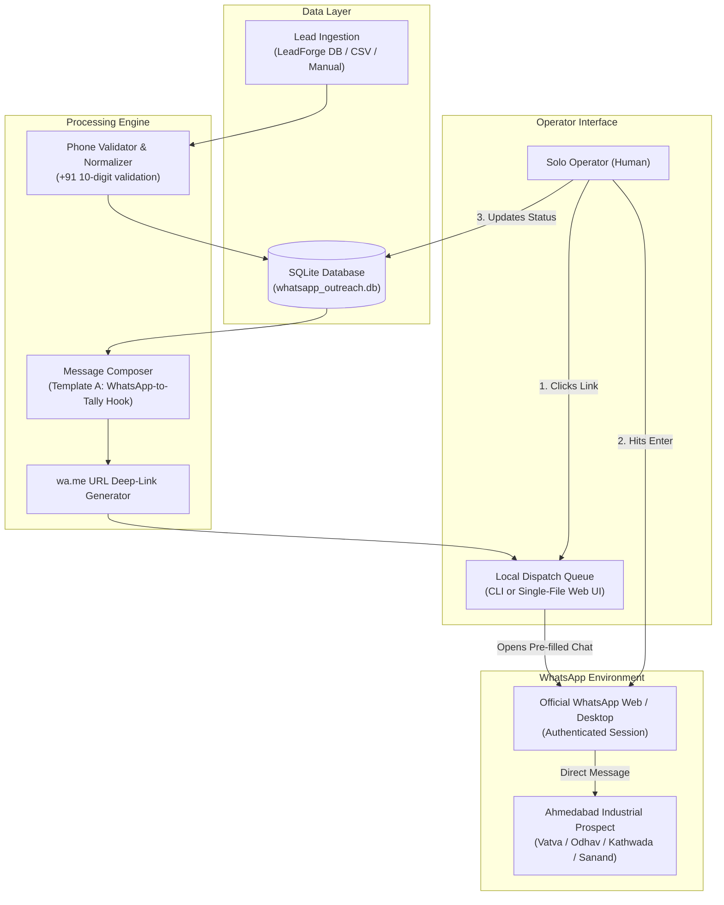

# WhatsApp-Auto: System Architecture & Design Document

## 1. What Is This System?
**WhatsApp-Auto** is a lightweight, zero-ban, solo-operator WhatsApp outreach engine designed specifically for B2B prospecting across Ahmedabad's industrial manufacturing clusters (Vatva GIDC, Odhav, Kathwada, Changodar, Sanand, Naroda).

Rather than relying on brittle, easily-banned headless browser hacks or expensive Meta Cloud API marketing fees, WhatsApp-Auto implements a **Semi-Automated 1-Click Dispatch Queue**:
1. It ingests verified local manufacturing leads (company name, product/machinery capability, industrial area, phone number).
2. It synthesizes short, professional, highly relevant WhatsApp opening messages using proven, direct templates (focusing on WhatsApp-to-Tally order entry and dispatch automation).
3. It generates pre-encoded deep links (`https://wa.me/91<phone>?text=<encoded_message>`).
4. The solo founder/operator clicks through the queue. Each click opens the native WhatsApp Web or WhatsApp Desktop application with the personalized message pre-filled. The operator performs a 2-second visual check and presses Enter to dispatch.
5. Interaction status (`SENT`, `REPLIED`, `NOT_ON_WA`, `UNSUBSCRIBED`) is recorded in a lightweight local SQLite database.

---

## 2. Why Do We Need This? (The Problem Context)

### The Cold Email Limitation in Ahmedabad Industrial Hubs
Over a 2-week cold email outreach run across 53 Ahmedabad manufacturers:
- **119 emails** were sent.
- **71.7% of emails** went to generic role inboxes (`info@company.com`, `sales@company.com`). In Gujarat manufacturing MSMEs, these inboxes are monitored by gatekeepers, clerks, or receptionists who filter only for incoming customer RFQs and delete all vendor/software emails.
- **~17% bounced** due to unmaintained corporate mail servers or dead domains.
- Only **1 genuine prospect reply** was received (~1.9% response rate).

### The WhatsApp Advantage in Gujarat Manufacturing
1. **Direct Access to Promoters & Partners**: In Gujarat MSMEs, the mobile number listed on Google Maps, IndiaMART, or factory signboards is carried directly by the Proprietor, Managing Director, or Plant Head.
2. **Instant Open Rates (>90%)**: Factory owners spend 4–6 hours a day on WhatsApp managing raw material quotes, transport bills, and customer purchase orders.
3. **Low Friction**: Responding to a short WhatsApp message takes 5 seconds, compared to drafting a formal email reply.

---

## 3. Ban Prevention & The Solo-Operator Threat Model

### How Meta Banning Works
Meta employs aggressive heuristic algorithms to detect spam on WhatsApp:
- **Unsaved Contact Velocity**: Sending 50+ messages in an hour to phone numbers that do not have you in their address book triggers automated fraud detection.
- **Identical Message Hashing**: Sending the exact same byte-for-byte text to multiple recipients flags the account for template spam.
- **Headless Browser Fingerprinting**: Unofficial Node/Puppeteer libraries (`baileys`, `puppeteer-whatsapp`) run headless Chrome instances with missing canvas fingerprints, missing battery APIs, and robotic mouse movements. Meta detects these client anomalies and issues permanent phone number bans without warning.
- **User Reports & Blocks**: If 2-3 recipients click "Report & Block" within a short window, the number is suspended.

### Why the 1-Click Queue is 100% Ban-Proof
1. **Real Human Environment**: Messages are sent from your legitimate WhatsApp Web / Desktop application on your actual IP and authenticated session. No headless browser emulation.
2. **Natural Keystroke & Dispatch Timing**: Human review introduces natural 15–45 second intervals between sends, which looks completely organic to Meta's traffic analyzers.
3. **Safe Volume Ceiling**: Capped strictly at **20–30 messages per day**. This volume delivers 600–750 direct decision-maker impressions per month with zero risk.
4. **Professional, Respectful Copy**: No generic hype, no "Hi team", no spammy links. The messages read like a professional inquiry from a local software engineer based in Ellisbridge.

---

## 4. System Architecture Diagram

---

## 5. Architectural Principles

1. **Zero External Heavy Dependencies**: No Docker, no Redis, no cloud databases, no monthly SaaS subscriptions. Standard Python 3 with built-in SQLite.
2. **Fail-Fast Error Handling**: If a phone number is invalid (e.g. landline or 8 digits), it fails cleanly at validation before reaching the queue.
3. **Total Transparency**: The operator always sees the exact message before it is sent. Nothing sends in the dark.
4. **Resumable State**: The queue remembers which contacts have been sent, pending, skipped, or replied. You can close the laptop anytime and resume where you left off.
5. **AI-Ready Simplicity**: Every component is modular, standalone, and documented so any LLM can understand, test, or extend it in minutes.
